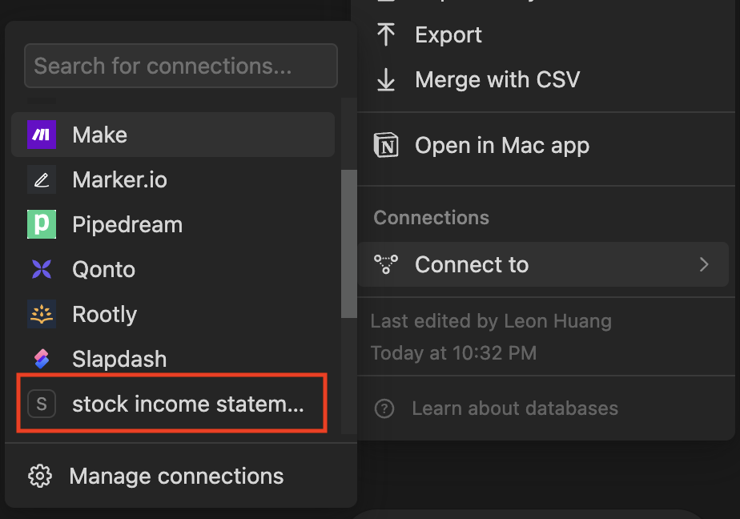

# notion stock income statement

This project demonstrates how to import Cathay Securities stock(國泰證卷 樹精靈) income statements into Notion's database.

## Requirement
* Notion account
    * Apply a Notion API and create a integration
    ```
    https://developers.notion.com/
    ```
    * Copy internal integration secret to NOTION_TOKEN
    * Duplicate this template to your Notion
    ```
    https://hallowed-building-f27.notion.site/76d6633c921e46869c94f1405b775435?v=7e6dc93a0151444998d9ccfbbae27862&pvs=4
    ```
    * Copy database ID to NOTION_DATABASE_ID
    * Connect with your integration
* Node.js 20
    * Run the following command to install packages and build.
    ```bash
    $ npm i
    $ npm run build
    ```

## Start import income statement to Notion
* Put .csv file in root
* Run the following command to start 
```bash
$ npm run start
```